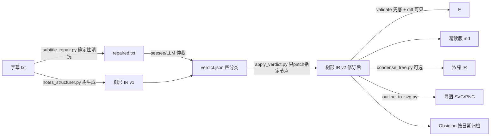

# 字幕 → 结构化学习笔记管道 · v5.4

把 B站课程/科普视频字幕自动变成**树形笔记 + 思维导图 + 忠实度审计报告**的一整套管道。
输入一个 BV 号或一份字幕，输出可进 Obsidian 的学习笔记。

---

## 1. 这是什么

一条"字幕 → 结构化笔记"的自动化流水线，核心设计理念是 **IR 解耦**：

```
语义层（LLM 只做语义判断）  →  展示层（笔记/导图两版本）  →  几何层（纯代码渲染）
```

- **语义层**：LLM 只判断"类型 + 层级"（新点 vs 展开的父子判定），输出扁平 JSON（树形 IR）
- **展示层**：同一份 IR 产出精读版 md + 概览版导图（可 LLM 浓缩）
- **几何层**：`outline_to_svg.py` 用栈重建树、生成 SVG/PNG——模型不碰布局

**闭环质量保障**：树生成后由 LLM 仲裁（verdict 四分类）→ 回流修订（只 patch 指出的节点，validate 兜底，diff 可见）→ 修订后的树才用于画图。

## 2. 解决什么问题

| 问题 | 方案 |
|---|---|
| B站字幕是流水账，人看不下去 | LLM 结构化：判类型 → 树形/清单/时间线 IR |
| 语篇关系标签（因果/并列…）模型判不准 | **points 级 level**（父子判定，模型天生擅长） |
| 导图过密/留白 | 逻辑型双版本（完整+浓缩）、盘点网格化、故事线性 |
| ASR 乱码污染内容（DeepSeek→1depsy） | 确定性修复 `subtitle_repair.py`（替换表+数字发音规则，零 LLM，不删行） |
| LLM 清洗会过度删除/数字靠猜 | 已废弃（clean_subtitle.py），改确定性脚本 + 外部仲裁 |
| 笔记可能有幻觉/脑补 | 分层审计：lexical n-gram → LLM 仲裁（verdict 四分类）→ 回流修订 |
| 单一结论不可信（单次采样） | eval harness：首次 attempt 口径 + 树合理性指标 |

## 3. 技术架构



**两个入口**：

```bash
# ① 单模型自主运行（可分发：只需一个 LLM 接入点 + 字幕目录）
python eval/harness_run.py                     # 处理 inbox/ 全部字幕
python eval/harness_run.py <字幕文件>           # 指定单份
# 配置：环境变量 或 harness.env（LLM_BASE_URL / LLM_API_KEY / LLM_MODEL）

# ② 完整管道（本地：抓取→清洗→树→Kimi仲裁→修订→画图→Obsidian）
python eval/notes_pipeline.py <字幕.txt> -o <out_dir> --condense --obsidian --name 视频名
```

## 4. 全逻辑型统一（v5.4）× 双版本

四类型路由废除：无论内容类型（课程/教程/故事/盘点），一律输出**逻辑型树形 IR**
（section + points level 1/2/3）。操作步骤映射为"流程/步骤子项"，叙事事件映射为
"背景→过程→结论"小节，只在 prompt 内决定小节组织方式，不改变输出结构。
validate() 只认「逻辑型」，其余类型直接报 type enum 错。

| 内容类型 | 小节组织（prompt 内映射，结构不变） | 导图形态 |
|---|---|---|
| 课程/科普 | 概念→机制→对比→结论 | 树形（完整版 / LLM 浓缩版） |
| 操作教程 | 前置→步骤流程→常见坑→完成标志 | 树形（步骤为 level 1/2 顺序子项） |
| 故事/经历/盘点 | 背景→过程→结论 | 树形 |

## 5. 质量体系

```
第一层  eval_harness.py     schema 合法率（首次 attempt 口径，防重试刷分）+ 树合理性指标（level 分布/树深/每节分支）
第二层  subtitle_repair.py  确定性清洗（零 LLM：替换表 + 数字发音规则，不删行，输出修复清单+疑点清单）
第三层  仲裁 (verdict)       LLM 对照字幕逐条校验树：must_fix / should_add / verify_later / ok_as_is
第四层  apply_verdict.py    回流修订：只 patch 指定节点 → validate → *_revised.json（diff 可见，不黑盒）
```

**实测基线**（deepseek-v4-flash，2026-09，10 样本 4 类型）：
- schema 合法率（首 attempt）：9/10 = 90%，最终通过率 100%
- 类型路由：已废除（v5.4 全逻辑型收拢，误判问题消失）
- 树合理性：level {1:327, 2:336}，平均树深 1.87，每节 4.4 分支
- 仲裁实测：Kimi k2.8 抓出树内 UTF-8 编码硬错误（E7 AC 83 → 应为 E7 8C AB）；**仲裁器自身也可能算错**（曾给出 E7 8C 85），世界知识类 must_fix 需程序复核

## 6. 部署（只部署了大模型的 harness）

见 `DEPLOY.md`。要点：
- 配置 `harness.env`（或环境变量）：`LLM_BASE_URL` / `LLM_API_KEY` / `LLM_MODEL`
- 字幕放入 `inbox/`，`python eval/harness_run.py` 全自动：清洗 → 树生成 → **同模型校验** → 修订 → 画图 → Obsidian
- 不依赖 B站凭证 / Hermes profile / se-esee
- 单模型校验有自证倾向：需要强校验时可配置独立校验模型（`step5_seesee.py --direct --model <其他模型>`）

## 7. 目录结构

```
notes_structurer.py      结构化（LLM + schema + validate + 升温重试）
outline_to_svg.py        IR → SVG（栈建树 / 网格 / 线性布局）
bili_fetch.py            抓字幕（B站 API，需凭证，可选环节）
eval/
  harness_run.py         单模型自主运行入口（可分发，见 DEPLOY.md）
  notes_pipeline.py      端到端闭环（清洗→树→仲裁→修订→画图→Obsidian）
  subtitle_repair.py     确定性字幕修复（零 LLM）
  step5_seesee.py        仲裁：树+字幕 → verdict.json（--direct 同模型直调 / 默认外部 Kimi）
  apply_verdict.py       回流修订（patch 节点 + validate + diff）
  condense_tree.py       导图前 LLM 浓缩
  audit_faithfulness.py  lexical 可追溯率粗筛
  eval_harness.py        eval（合法率 + 树指标）
  test_validate.py       validate 回归单测
  harness_stress_test.py 压测 driver（真实视频批量 + pipe 并发流水线 + 逐条耗时/字数 + stress_test_report.md）
```

## 8. 已知限制 / 路线

- ~~操作型不能出图~~ **已解决（v5.4）**：全类型统一逻辑树，操作型教程同样出树形导图
- 单模型校验有自证倾向（树生成与校验同模型），强校验需独立模型
- 单次采样噪声：`--repeat N` 未实现
- eval 样本决策/叙事各仅 1-2 条，统计弱
- 只处理 B站字幕（通用网页需另加抓取层）

## 9. 版本历史

- **v4**：4 类型 + 8 类 relation 标签（已废弃——语篇标签对模型是弱项）
- **v5**：points 级 level 树形 IR（relation → 父子判定）
- **v5.1**：叙事型双形态（timeline/list）、非逻辑型导图、Obsidian 按日期归档
- **v5.2**：字幕修复确定性化（LLM 清洗废弃：过度删除/数字靠猜）、LLM 评估外部化
- **v5.3**：仲裁→修订闭环（verdict 四分类 → apply_verdict 回流）、`harness_run.py` 单模型自主部署
- **v5.4**：全逻辑型收拢——四类型路由/四套 schema/操作型与叙事型渲染分支全部移除，validate 只认逻辑型

## 免责声明

- 字幕版权归视频作者所有；本管道只处理你有权使用的字幕，导出的笔记仅限个人学习
- 字幕多为 ASR 自动转写，专名/数字可能有错乱——这正是本管道清洗与仲裁环节要处理的
